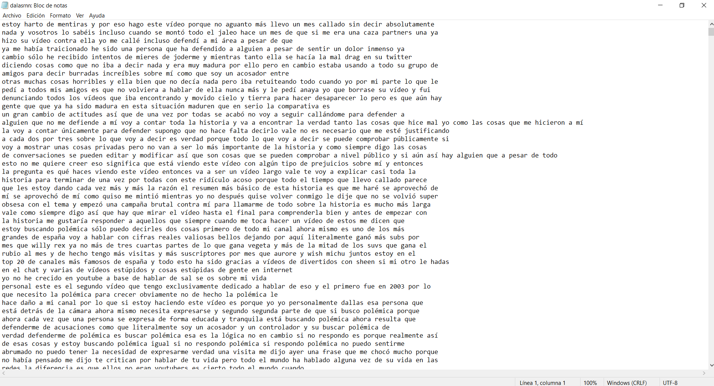

#### Contenidos de este repositorio

* carpeta [assets/](/assets/):
   * archivo [WorkSans-Light.ttf](/assests/WorkSans-Light.ttf)
* carpeta [imagenes/](imagenes/):
   * archivo [dalas_txt.png](/imagenes/dalas_txt.png)
   * archivo [google_colab_01.png](/imagenes/google_colab_01.png)
   * archivo [google_colab_02.png](/imagenes/google_colab_02.png)
   * archivo [google_colab_03.png](/imagenes/google_colab_03.png)
   * archivo [google_colab_04.png](/imagenes/google_colab_04.png)
   * archivo [google_colab_05.png](/imagenes/google_colab_05.png)
   * archivo [google_colab_06.png](/imagenes/google_colab_06.png)
   * archivo [google_colab_07.png](/imagenes/google_colab_07.png)
   * archivo [google_colab_08.png](/imagenes/google_colab_08.png)
   * archivo [charnnfuncionando.mp4](/imagenes/charnnfuncionando.mp4)
   * archivo [dalasrnnfuncionando2.mp4](/imagenes/dalasrnnfuncionando2.mp4)
* carpeta [libraries/](/libraries):
   * archivo [ml5.min.js](/libraries/ml5.min.js)
   * archivo [p5.js](/libraries/p5.js)
   * archivo [p5.min.js](/libraries/p5.min.js)
* carpeta [models/dalas/](/models/dalas):
   * archivo [Variable](/models/dalas/Variable)
   * archivo [embedding](/models/dalas/embedding)
   * archivo [manifest.json](/models/dalas/manifest.json)
   * archivo [rnnlm_multi_rnn_cell_cell_0_basic_lstm_cell_bias](/models/dalas/rnnlm_multi_rnn_cell_cell_0_basic_lstm_cell_bias)
   * archivo [rnnlm_multi_rnn_cell_cell_0_basic_lstm_cell_kernel](/models/dalas/rnnlm_multi_rnn_cell_cell_0_basic_lstm_cell_kernel)
   * archivo [rnnlm_multi_rnn_cell_cell_1_basic_lstm_cell_bias](/models/dalas/rnnlm_multi_rnn_cell_cell_1_basic_lstm_cell_bias)
   * archivo [rnnlm_multi_rnn_cell_cell_1_basic_lstm_cell_kernel](/models/dalas/rnnlm_multi_rnn_cell_cell_1_basic_lstm_cell_kernel)
   * archivo [rnnlm_softmax_b](/models/dalas/rnnlm_softmax_b)
   * archivo [rnnlm_softmax_w](/models/dalas/rnnlm_softmax_w)
   * archivo [vocab.json](/models/dalas/vocab.json)
* archivo [index.html](index.html)
* archivo [sketch.js](sketch.js)
* archivo [style.css](style.css)
* archivo [README.md](README.md)

____

_22-09-2023_

# Sobre Dalasrnn

[Dalasrnn](https://gloriaherrera.github.io/dalasrnn/) es una inteligencia artificial de generación de texto diseñada para imitar los patrones del habla del youtuber español Daniel Santomé Lemus, más conocido como [DalasReview](https://www.youtube.com/@DalasReview/featured). 

Dalas es un youtuber de comentarios y críticas, popularizado por su participación en diversas polémicas de la plataforma, al tomar esto gran cantidad de sus videos, es conocido por la utilización de un lenguaje muy fuerte en la que abundan acusaciones graves y nombres de otros youtubers.

Nuestro objetivo con esta inteligencia era entrenarla para poder encontrar estas mismas acusaciones.

 [**Gloria Herrera**](https://github.com/gloriaherrera), [**Amelia López**](https://github.com/Ax0lMar) y [**Camila Méndez**](https://github.com/camilamendezm) para audiv027-2023-2. Electivo Ambas Menciones: Inteligencia Artificial  
DOCENTE: [**Aaron Montoya Moraga**](https://github.com/montoyamoraga) - FAU.UCHILE -  

____

____

#### Materiales

* [Python environment manager](https://blog.devgenius.io/python-environment-management-d920f20ea53e)
* [Charrnn](https://github.com/ml5js/training-charRNN)
* [Pyenv](https://github.com/pyenv/pyenv-installer)
* Python 3.6
* Tensorflow
* Archivo .txt

#### Videos utilizados

* [Así SIGUE Mintiendo Wismichu: Lo desmonto PUNTO POR PUNTO Todo](https://www.youtube.com/watch?v=lhbBwKW0Sw4)
* [el vídeo definitivo (Resubida en HD) - se acabó, wismichu e ingrid](https://www.youtube.com/watch?v=htMr2QgQv9Q&t=1s)
* [Dalas da a probar a JP de SU PROPIA MEDICINA (al final se demuestra cómo JP es un FALSO)](https://www.youtube.com/watch?v=f2hm_M5Mb4M)
* [para mi ex: DÉJAME VIVIR.](https://www.youtube.com/watch?v=Ig0Kn2esAg4)
* [estoy harto de mentiras y por eso hago este vídeo](https://www.youtube.com/watch?v=Y-qOt6KinYo&t=207s)
* [Auron y Biyin: NACIdos para el Lado Oscuro](https://www.youtube.com/watch?v=-dsy2p2QZDk&t=3580s)
* [Auron y Biyin no tienen Amigos, tienen Parásitos](https://www.youtube.com/watch?v=J4d3nET3Gew)
* [Querido Dross Rotzank,... te has convertido en todo lo que odiabas.](https://www.youtube.com/watch?v=UQLhROlG82I)

____

### Proceso

* Recopilar texto a través de transcripciones de videos del canal de youtube de [DalasReview](https://www.youtube.com/@DalasReview/featured).
* Crear un archivo .txt con las transcripciones de videos.

  
* Abrir un google colab, el cual usamos previamente para hacer un modelo de [El Quijote](https://github.com/disenoUChile/audiv027-2023-2/blob/main/clases/clase-02/2023_audiv027_char_rnn_quijote.ipynb).
* Subir archivo .txt a un google colab.
* Reemplazar archivo [El Quijote](https://github.com/disenoUChile/audiv027-2023-2/blob/main/clases/clase-02/2023_audiv027_char_rnn_quijote.ipynb) con el nuevo archivo de texto dentro del código.
* Entrenar código con el texto subido. (agregar foto google colab)

* Descargar archivo comprimido.
* Crear repositorio en github.
* Copiar el código de [ejemplo-ml5js-char-rnn](https://github.com/camilamendezm/audiv027-2023-2/tree/main/clases/clase-04/ejemplo-ml5js-char-rnn) y reemplazar los archivos antiguos (El Quijote) con los nuevos (Dalasrnn).

____

### Referentes

**Código basado en:**
* Ejemplo de clase audiv027-2023-2
    https://github.com/disenoUChile/audiv027-2023-2/tree/main/clases/clase-04/ejemplo-ml5js-char-rnn
* Ejemplo de chaRNN
    [El Quijote CHARRNN](https://github.com/disenoUChile/audiv027-2023-2/blob/main/clases/clase-02/2023_audiv027_char_rnn_quijote.ipynb)

____

## Conclusiones

Aprendijazes:

* Trabajar código en equipo.
* Entender el proceso de charRNN, mientras más texto tenga más coherente será.
* Lanzar una página en GitHub en equipo, usando todas las herramientas que GitHub nos entrega (repositorios, pull request, etc)

Dificultades:

* Ordenar informacion en MarkDown.
* Trabajar 3 personas en un mismo repositorio.
* Corroborar nombres de archivos

